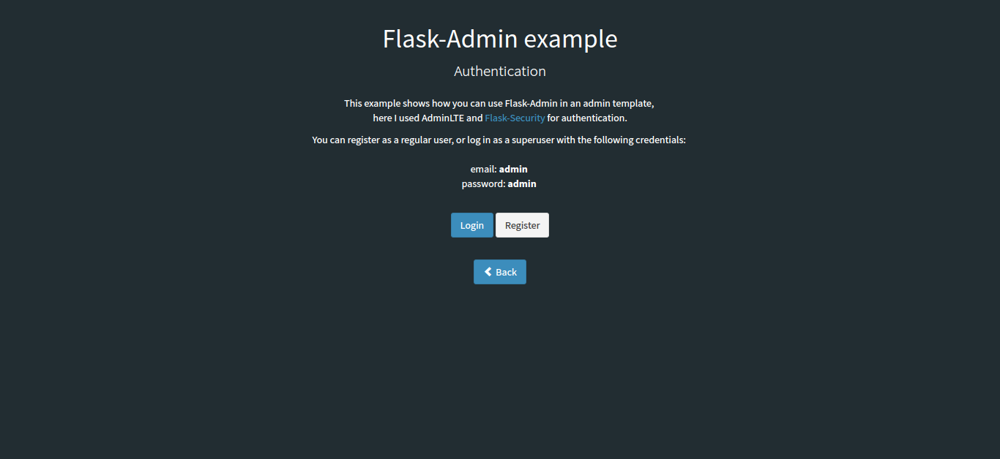

# Flask-Admin Dashboard Example

Basic dashboard app with Admin LTE template and Flask Admin, it has:

- User Registration
- Login as general or admin user
- Roles management
- Create form in modal window by default
- Inline editing enabled by default
- Skins and  layout customization
- Dashboard, charts, chat and calendar examples
 
Utilities: 

  - AdminLTE Bootstrap template
  - Flask-Security
  - Flask-Admin
  - A lot of Charts libraries
  - SQLite

## Installation des dépendances
Installation des packages nécessaires à l'application
```sh
conda install --file requirements.txt
```

NB: Si des packages non pris en charge par `conda` doivent être installés via `pip` un fichier `requirements_pip.txt` devra être créé (`pip install -r requirements_pip.txt`)

## Lancement de l'application
Pour lancer localement ce rapport, exécuter depuis ce dossier : 

```sh
python app.py
```

## Screenshots



**I hope you enjoy it.**
